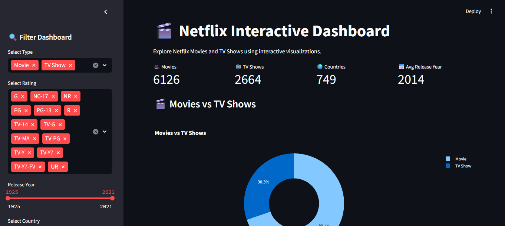
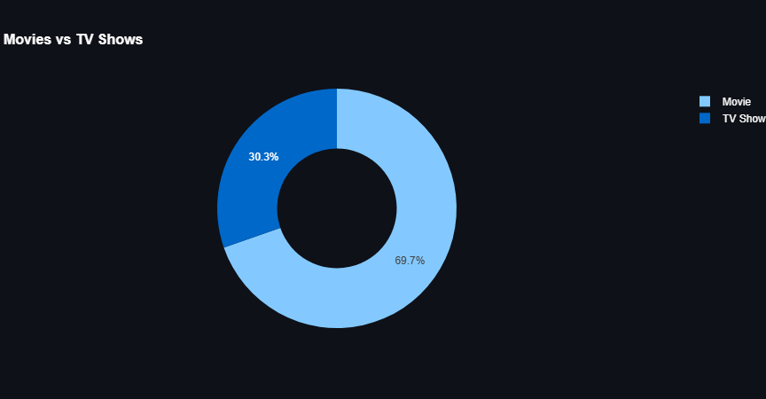
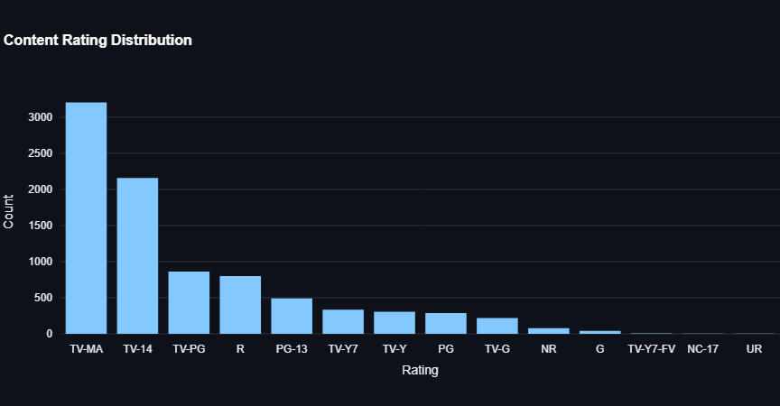
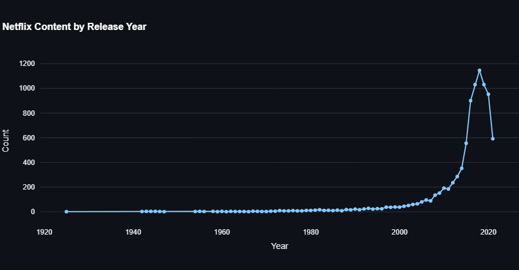
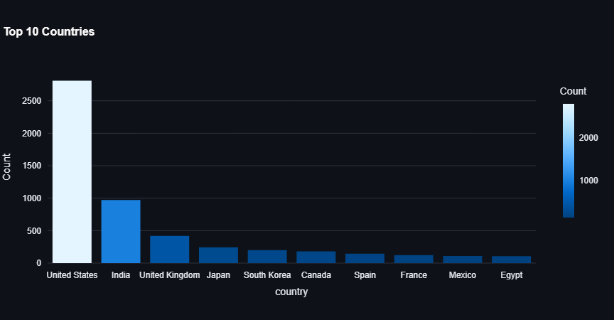
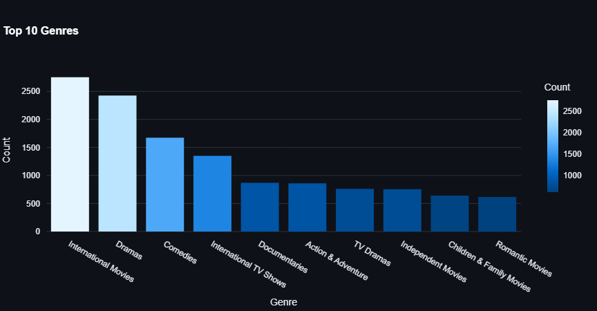
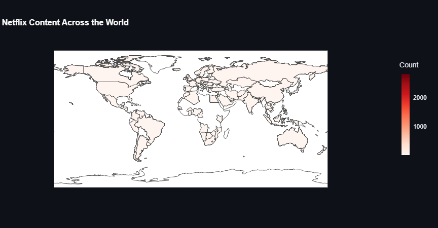
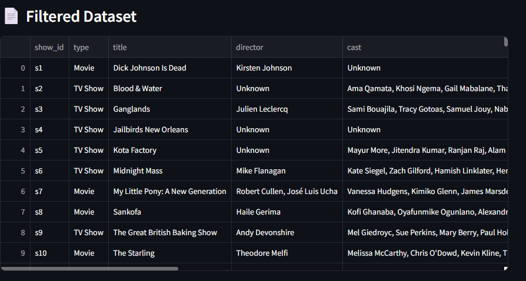

# 🎬 Netflix Interactive Dashboard

An interactive data visualization dashboard built with **Streamlit** and **Plotly** to explore the Netflix Movies and TV Shows dataset. The dashboard provides interactive filtering, advanced visualizations, and geospatial analysis to uncover trends in Netflix's global content library.

---

## 📌 Project Overview

This project demonstrates advanced data visualization techniques by transforming the Netflix Titles dataset into an interactive dashboard. Users can filter content by type, rating, country, and release year while exploring insightful visualizations and global content distribution.

The project was developed as part of a **Data Science Internship** focusing on advanced visualization and dashboard development.

---
# Live Demo

https://netflix-interactive-dashboard1.streamlit.app/

---

## 🚀 Features

* 📊 Interactive KPI Cards
* 🎥 Movies vs TV Shows Distribution
* ⭐ Content Rating Analysis
* 📈 Release Year Trend Analysis
* 🌍 Top Countries by Netflix Content
* 🎭 Top Genres
* 🗺️ Geospatial World Map Visualization
* 🔍 Sidebar Filters
* 📄 Interactive Dataset Preview

---

## 📂 Project Structure

```text
Netflix-Interactive-Dashboard
│
├── data/
│   └── netflix_titles.csv
│
├── images/
│   ├── dashboard_overview.png
│   ├── pie_chart.png
│   ├── rating_chart.png
│   ├── release_trend.png
│   ├── top_countries.png
│   ├── top_genres.png
│   ├── world_map.png
│   └── filtered_dataset.png
│
├── app.py
├── requirements.txt
├── README.md
└── .gitignore
```

---

## 📊 Dashboard Visualizations

### Dashboard Overview



---

### Movies vs TV Shows



---

### Content Rating Distribution



---

### Release Year Trend



---

### Top Countries



---

### Top Genres



---

### Global Content Distribution



---

### Filtered Dataset Preview



---

## 📈 Key Insights

* Netflix hosts significantly more **Movies** than **TV Shows**.
* Content production increased rapidly after **2015**.
* The **United States** contributes the largest amount of Netflix content.
* Drama, International Movies, and Comedy are among the most popular genres.
* Interactive filters allow users to explore the dataset dynamically.
* The geospatial visualization highlights Netflix's worldwide content distribution.

---

## 🛠️ Technologies Used

* Python
* Streamlit
* Plotly Express
* Pandas
* NumPy
* Matplotlib
* Seaborn

---

## 📦 Installation

### Clone the repository

```bash
git clone https://github.com/your-username/Netflix-Interactive-Dashboard.git
```

### Navigate to the project

```bash
cd Netflix-Interactive-Dashboard
```

### Install dependencies

```bash
pip install -r requirements.txt
```

### Run the dashboard

```bash
streamlit run app.py
```

---

## 📋 Requirements

```
streamlit==1.37.1
pandas==2.2.3
numpy==2.2.6
plotly==5.24.1
matplotlib==3.10.3
seaborn==0.13.2
```

---

## 🎯 Learning Outcomes

Through this project, I gained hands-on experience with:

* Interactive dashboard development using Streamlit
* Advanced data visualization using Plotly
* Data preprocessing and cleaning
* Geospatial data visualization
* Interactive filtering techniques
* Presenting analytical insights through visual storytelling

---

## 📜 Dataset

**Netflix Movies and TV Shows Dataset**

Source: Kaggle

---

## 👨‍💻 Author

**Zaara Khan**

Data Science Internship Project.


---

